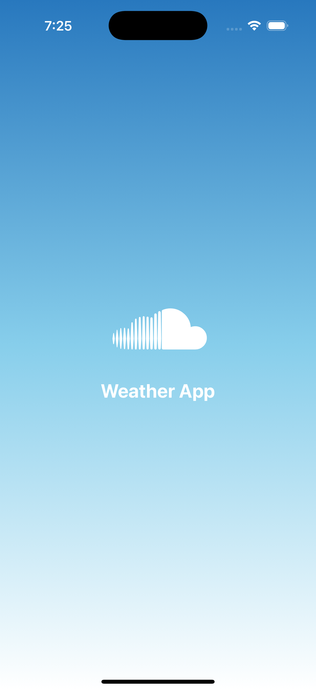

## Prerequisites

## Install Required Tools:
   1. Node.js (Latest Node version recommended but minimum 18 or later required)
   2. React Native CLI: Install globally using npm install -g react-native.
   3. Watchman (for macOS users).
   4. Android Studio (install with Android SDK, set up an emulator, or enable USB Debugging on a device).
   4. Xcode 16 or Later(for iOS development, macOS only).
   6. React Native Environment Setup: Follow the Environment Setup Guide for your platform and choose the "React Native CLI Quickstart" tab.

## Install Dependencies
   Navigate to your project directory and install all dependencies:
   # Using npm
   npm install

   # OR using Yarn
   yarn install
   
## Start the Metro Bundler
   Metro is the JavaScript bundler that React Native uses. Start it with:

   # Using npm
   npm start

   # OR using Yarn
   yarn start

## Run the App
   # For Android: JDK 17 or Later On
      In a new terminal, run:

   # Using npm
   npm run android

   # OR using Yarn
   yarn android

   Ensure you have an Android emulator running or a physical device connected with USB Debugging enabled.

   # For iOS (macOS only): Xcode 16 Required
      In a new terminal, run:

   # Using npm
   npm run ios

   # OR using Yarn
   yarn ios

   Make sure Xcode is installed, and set up your development team if you're running the app on a physical device.

React Native Documentation(https://reactnative.dev/docs/getting-started)
Integration Guide(https://reactnative.dev/docs/integration-with-existing-apps)

# Android Screenshot

    
    
    
    
    

# iOS Screenshot

    
    
    
    
    

